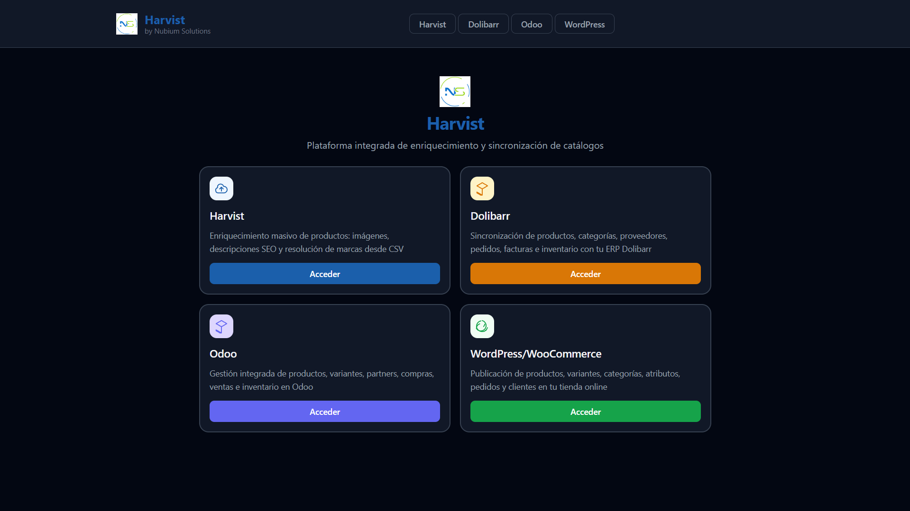
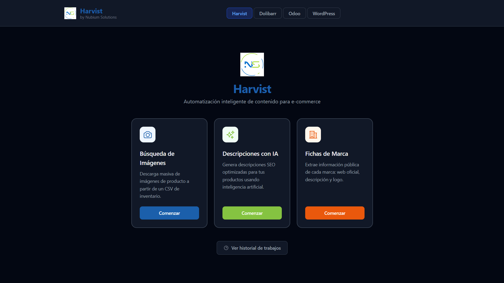
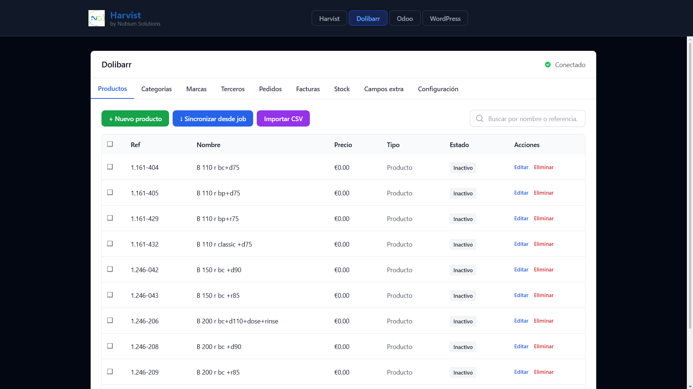
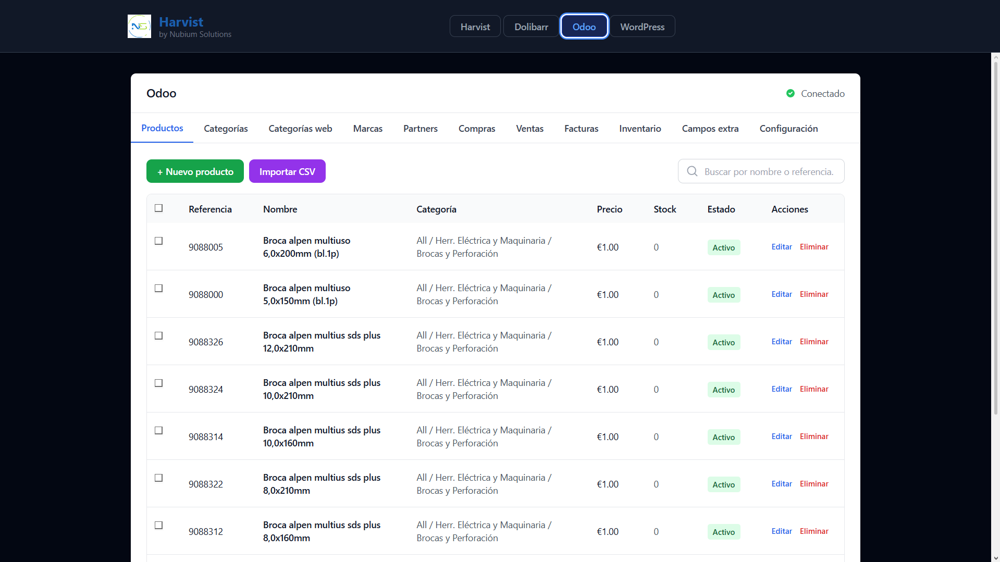
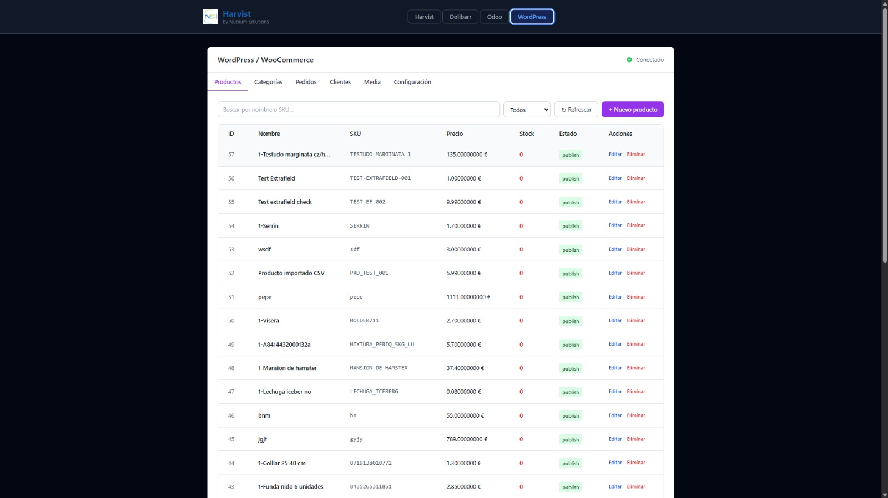

<div align="center">

# Harvist

### Plataforma integrada de enriquecimiento y sincronización de catálogos de producto

[](https://python.org)
[](https://fastapi.tiangolo.com)
[](https://react.dev)
[](https://typescriptlang.org)
[](https://redis.io)
[](https://docs.celeryq.dev)
[](tests/)

<br/>

> Automatización inteligente de catálogos para e-commerce — imágenes, descripciones SEO con IA, resolución de marcas y sincronización con los principales ERPs y CMS del mercado.
>
> Desarrollado por **BenjaminDTS** & **Carlos Vico** · Nubium Solutions

</div>

---

## Capturas de pantalla

<div align="center">

### Dashboard principal


</div>

<br/>

<table>
<tr>
<td width="50%">

**Módulo Harvist** — Enriquecimiento de catálogo


</td>
<td width="50%">

**Módulo Dolibarr** — ERP integrado


</td>
</tr>
<tr>
<td width="50%">

**Módulo Odoo** — Gestión ERP


</td>
<td width="50%">

**Módulo WordPress / WooCommerce**


</td>
</tr>
</table>

---

## ¿Qué hace Harvist?

<table>
<tr>
<td width="50%" valign="top">

### 📸 Búsqueda de Imágenes
Descarga masiva de imágenes de productos directamente desde un CSV de inventario. Busca en Bing, Google o DuckDuckGo usando Selenium con `undetected-chromedriver` para evitar bloqueos. Valida cada imagen con Pillow (dimensiones, formato, corrupción), redimensiona y entrega todo en un ZIP listo para usar.

</td>
<td width="50%" valign="top">

### 🤖 Descripciones con IA
Genera descripciones SEO optimizadas en batch usando **Groq** (llama-3.3-70b) o **Anthropic Claude**. Cada producto recibe: descripción corta (gancho), descripción larga (persuasiva), keywords y meta_description. Soporta reintentos con backoff exponencial y exportación CSV integrada.

</td>
</tr>
<tr>
<td width="50%" valign="top">

### 🏷️ Fichas de Marca
Resuelve `EAN → Marca` mediante una cascada automática de **8 niveles** sin Selenium:
1. Checksum GS1 Módulo 10
2. Caché local de prefijos conocidos
3. Amazon.es
4–6. Open Pet Food Facts / Open Food Facts / UPCItemDb
7. Google Dorking
8. Bing Search

Aprende automáticamente y registra prefijos nuevos para acelerar trabajos futuros.

</td>
<td width="50%" valign="top">

### 🔄 Integraciones ERP / CMS
Gestiona y sincroniza catálogos directamente desde Harvist, sin salir de la plataforma:

- **Dolibarr** — Productos, categorías, marcas, terceros, pedidos, facturas, stock, campos extra
- **Odoo** — Productos + variantes, partners, compras, ventas, inventario, facturas
- **WordPress / WooCommerce** — Productos, variantes, categorías, pedidos, clientes, medios

Cada módulo muestra indicador de conexión en tiempo real.

</td>
</tr>
</table>

---

## Stack tecnológico

<div align="center">

| Capa | Tecnología |
|:-----|:-----------|
| 🐍 **Backend** | Python 3.11 · FastAPI 0.111 · Uvicorn |
| ⚙️ **Tareas asíncronas** | Celery 5.4 · Redis 7 |
| 🕷️ **Scraping** | Selenium 4 · undetected-chromedriver · Pillow |
| 🧠 **IA** | Groq API (llama-3.3-70b) · Anthropic Claude API |
| ⚛️ **Frontend** | React 18 · TypeScript · Vite · Tailwind CSS |
| 🗄️ **Almacenamiento** | Local · AWS S3 · Azure Blob Storage |
| ✅ **Testing** | pytest · pytest-asyncio · pytest-cov · 130+ tests |
| 📖 **API Docs** | OpenAPI 3.1 · Swagger UI |

</div>

---

## Instalación

### Requisitos previos

- **Python 3.11+**
- **Node.js 18+** y npm
- **Redis 7** — vía Docker (recomendado)
- **Navegador** — Chrome, Chromium, Edge, Brave u Opera GX

### 1 · Clonar el repositorio

```bash
git clone https://github.com/BENJAMINDTS/Harvist.git
cd Harvist
```

### 2 · Instalar dependencias

```bash
# Backend Python
python -m venv .venv
source .venv/bin/activate   # Windows: .venv\Scripts\activate
pip install -e ".[dev]"

# Frontend
cd frontend && npm install && cd ..
```

### 3 · Configurar entorno

```bash
cp .env.example .env.development
```

Variables mínimas para arrancar:

```env
APP_ENV=development

# Navegador
BROWSER_TYPE=chrome
BROWSER_BINARY_PATH=C:\Program Files\Google\Chrome\Application\chrome.exe

# IA — elige uno
AI_PROVIDER=groq
GROQ_API_KEY=gsk_...

# Integraciones (solo las que uses)
DOLIBARR_URL=https://mi-dolibarr.com
DOLIBARR_API_KEY=

ODOO_URL=http://localhost:8069
ODOO_DB=nombre_bd
ODOO_USER=admin@empresa.com
ODOO_PASSWORD=

WORDPRESS_URL=https://mi-tienda.com
WORDPRESS_CONSUMER_KEY=ck_...
WORDPRESS_CONSUMER_SECRET=cs_...
```

Ver [`.env.example`](.env.example) para la referencia completa.

### 4 · Crear directorio de datos

```bash
mkdir data
```

---

## Arrancar los servicios

Lanza los cuatro servicios en este orden:

```bash
# 1 — Redis
docker run -d -p 6379:6379 redis:7-alpine

# 2 — Celery worker
.venv/bin/celery -A workers.celery_app worker --loglevel=info --pool=solo

# 3 — FastAPI backend
.venv/bin/uvicorn api.main:app --reload --host 0.0.0.0 --port 8000

# 4 — Frontend Vite
cd frontend && npm run dev
```

<div align="center">

| Servicio | URL |
|:---------|:----|
| 🌐 **Frontend** | http://localhost:5173 |
| 🔌 **API REST** | http://localhost:8000/api/v1 |
| 📖 **Swagger UI** | http://localhost:8000/api/docs |
| 🗄️ **Redis** | localhost:6379 |

</div>

> Si usas el skill `/launch` de Claude Code, los cuatro servicios arrancan con un solo comando.

---

## Uso básico

1. Abre **http://localhost:5173**
2. Accede al módulo **Harvist** y elige una herramienta:

| Herramienta | Qué hace | Entrada |
|:------------|:---------|:--------|
| **Búsqueda de Imágenes** | Descarga imágenes por producto, genera ZIP | CSV con `codigo` + `nombre` o `ean` |
| **Descripciones con IA** | Genera textos SEO en batch | CSV de inventario + tipo de tienda |
| **Fichas de Marca** | Resuelve EAN → marca para todo el catálogo | CSV con columna `ean` |

3. Para **ERPs / CMS**, usa las pestañas Dolibarr, Odoo o WordPress — conecta tus credenciales en Configuración y gestiona tu catálogo directamente.

### Formato de CSV de entrada

```csv
codigo,nombre,ean
REF-001,Collar ajustable para perro,8435269012345
REF-002,Comedero acero inoxidable,8435269012346
```

---

## Estructura del proyecto

```
harvist/
├── api/                        # Capa HTTP — recibe, valida, delega
│   ├── core/                   # Config (Pydantic v2) · Logging (loguru) · Security
│   └── v1/
│       ├── endpoints/          # jobs · files · dolibarr · odoo · wordpress
│       └── schemas/            # JobCreate · JobStatus · TipoJob · EstadoJob
│
├── services/                   # Lógica de negocio pura
│   ├── scraper/                # pipeline · producer (Selenium) · consumer (ThreadPool) · brand_scraper
│   ├── ai/                     # groq_client · description_generator
│   └── integrations/           # base · dolibarr/ · odoo/ · wordpress/
│
├── workers/                    # Celery app + tasks
├── tests/                      # 130+ tests unitarios e integración
├── frontend/
│   └── src/
│       ├── components/         # CsvUploader · SearchConfig · JobProgress · JobHistory · paneles ERP
│       └── hooks/              # useJobWebSocket (reconexión automática con backoff)
│
├── docs/screenshots/           # Capturas de la interfaz
├── data/                       # Git-ignored — brand_cache.json · gs1_prefixes.db
├── .env.example
└── pyproject.toml
```

---

## Testing

```bash
# Todos los tests
pytest

# Solo unitarios
pytest tests/unit/

# Solo integración
pytest tests/integration/ -v

# Con cobertura
pytest --cov=api --cov=services --cov=workers
```

```bash
# Linter Python
ruff check .

# Auditoría de dependencias
pip-audit

# Type-check Frontend
cd frontend && npm run type-check
```

---

## Seguridad

- Secretos exclusivamente en `.env` — nunca en código ni en Git
- CORS con lista blanca explícita — nunca `*`
- Rate limiting en todos los endpoints públicos (`slowapi`)
- Cabeceras de seguridad HTTP en todas las respuestas
- Validación Pydantic en entrada · logging JSON sin datos sensibles
- HTTPS obligatorio en staging y producción

---

## Equipo

<div align="center">

| | Nombre | Contribuciones |
|:---:|:-------|:--------------|
| 👤 | **BenjaminDTS** · [GitHub](https://github.com/BENJAMINDTS) | Arquitectura · Backend · Frontend · Scraping · IA · Integraciones ERP/CMS · Testing |
| 👤 | **Carlos Vico** · [GitHub](https://github.com/Carlitos6712) | Arquitectura · Backend · Frontend · Scraping · IA · Integraciones ERP/CMS · Testing |

</div>

---

<div align="center">

**Harvist** · Nubium Solutions · 2026

---

### Licencia

Uso **no comercial** con atribución obligatoria y compartir igual.
Permitido para uso personal, educativo, investigación y proyectos sin ánimo de lucro.
Para licencias comerciales contacta a los autores. Ver [`LICENSE`](LICENSE) para los términos completos.

</div>
